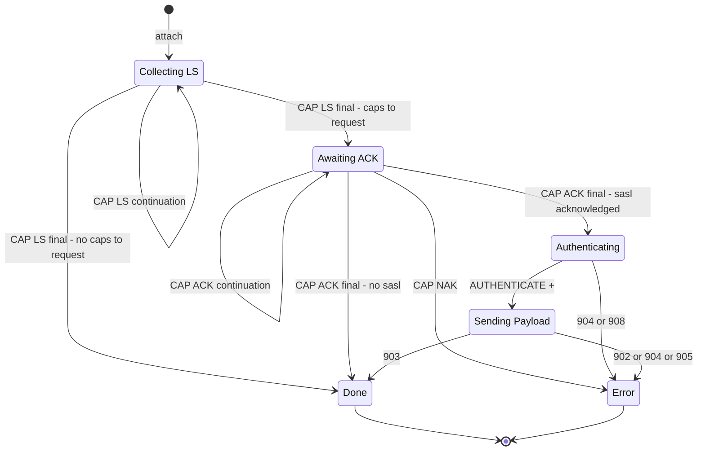

# Registration State Machine

A single state machine covering CAP negotiation and SASL authentication. Its job is narrowly defined: **get from attach to CAP END**. 001 and post-registration concerns are handled externally — this machine does not listen for or react to `RPL_WELCOME`.

Every outbound message is produced by a transition. There is one exit point for actions.

## Key constraints

- `sasl` is the only capability the machine has specific knowledge of. It must be handled before `CAP END`.
- The machine includes `sasl` in the requested set when `config.sasl` is present. The consumer does not choose capabilities.
- When SASL is configured and fails (NAK, 904, 902, 905), the machine errors out. It does not fall through to unauthenticated registration. The consumer decides whether to close the connection.
- `PING` during registration is handled externally.
- 001 is handled externally. If the server has no CAP support, it registers us immediately — the machine simply never receives the CAP LS response it's waiting for and takes no further action. Self-quenching.
- The machine does not attempt recovery on CAP NAK or SASL failure. Error means stop.
- Registration timeout is the consumer's responsibility. No timer in the machine.

## Tracked state

- **Available caps** (`Set<string>`): accumulated from `CAP LS` lines. Discarded after `CAP REQ`.
- **Acknowledged caps** (`Set<string>`): accumulated from `CAP ACK` lines. Used only to check if `sasl` is present. Then written to `runtime.activeCaps` and discarded.

No retry counters. No pending action queues. No timers.

## Messages we act on

| Message               | State           | Action                                                       |
| --------------------- | --------------- | ------------------------------------------------------------ |
| `CAP LS *`            | Collecting LS   | Accumulate available caps. Stay in state.                    |
| `CAP LS` (final)      | Collecting LS   | Determine intersection of available ∩ supported. REQ or END. |
| `CAP ACK *`           | Awaiting ACK    | Accumulate acknowledged caps. Stay in state.                 |
| `CAP ACK` (final)     | Awaiting ACK    | Check for sasl → Authenticate or END.                        |
| `CAP NAK`             | Awaiting ACK    | Error.                                                       |
| `AUTHENTICATE +`      | Authenticating  | Send SASL PLAIN payload.                                     |
| `904 ERR_SASLFAIL`    | Authenticating  | Error. Mechanism rejected.                                   |
| `908 RPL_SASLMECHS`   | Authenticating  | Error. Mechanism unavailable.                                |
| `903 RPL_SASLSUCCESS` | Sending Payload | CAP END. Done.                                               |
| `902 ERR_NICKLOCKED`  | Sending Payload | Error.                                                       |
| `904 ERR_SASLFAIL`    | Sending Payload | Error.                                                       |
| `905 ERR_SASLTOOLONG` | Sending Payload | Error.                                                       |

## Intentionally ignored messages

These messages may arrive during the machine's lifetime. We are aware of them and explicitly do nothing. This is not a gap — it is a design choice.

| Message                    | Why we ignore it                                                                                                                                                                                                                              |
| -------------------------- | --------------------------------------------------------------------------------------------------------------------------------------------------------------------------------------------------------------------------------------------- |
| `001 RPL_WELCOME`          | Registration completion is external to this machine. Handled by the `identity` feature. If the server has no CAP support and registers us immediately, the machine never receives its expected `CAP LS` response and takes no further action. |
| `002 RPL_YOURHOST`         | Post-registration informational. Not our concern.                                                                                                                                                                                             |
| `003 RPL_CREATED`          | Post-registration informational. Not our concern.                                                                                                                                                                                             |
| `004 RPL_MYINFO`           | Post-registration informational. Not our concern.                                                                                                                                                                                             |
| `005 RPL_ISUPPORT`         | Post-registration informational. Not our concern.                                                                                                                                                                                             |
| `410 ERR_INVALIDCAPCMD`    | Server rejected an unknown CAP subcommand. We didn't send one. Ignore.                                                                                                                                                                        |
| `432 ERR_ERRONEUSNICKNAME` | Nick rejected. Our state is unaffected — we already sent NICK. Consumer handles.                                                                                                                                                              |
| `433 ERR_NICKNAMEINUSE`    | Nick in use. Same as above. Consumer handles.                                                                                                                                                                                                 |
| `464 ERR_PASSWDMISMATCH`   | Password wrong. Our state is unaffected — we already sent PASS. Consumer handles.                                                                                                                                                             |
| `901 RPL_LOGGEDOUT`        | Account unset. Not during registration. Ignore.                                                                                                                                                                                               |
| `906 ERR_SASLABORTED`      | Client-initiated abort. We don't abort. Ignore.                                                                                                                                                                                               |
| `907 ERR_SASLALREADY`      | Already authenticated. Should not happen during our flow. Ignore.                                                                                                                                                                             |
| `NOTICE *`                 | Server banners during registration. Not protocol-significant. Ignore.                                                                                                                                                                         |
| `PING`                     | Handled externally by the `ping` feature.                                                                                                                                                                                                     |
| `CAP NEW`                  | Post-registration cap notification. Outside our scope.                                                                                                                                                                                        |
| `CAP DEL`                  | Post-registration cap notification. Outside our scope.                                                                                                                                                                                        |
| `CAP LIST`                 | Response to CAP LIST query, which we never send. Ignore.                                                                                                                                                                                      |

## Diagram

## Transition actions

Each transition produces zero or more outbound messages:

| Transition                        | Actions                                                    |
| --------------------------------- | ---------------------------------------------------------- |
| `attach` → CollectingLs           | `CAP LS 302`, `PASS` (if configured), `NICK`, `USER`       |
| CAP LS continuation               | None — accumulate available caps                           |
| CAP LS final → AwaitingAck        | `CAP REQ :<available ∩ supported>`                         |
| CAP LS final → Done               | `CAP END`                                                  |
| CAP ACK continuation              | None — accumulate acknowledged caps                        |
| CAP ACK final → Authenticating    | `AUTHENTICATE PLAIN`                                       |
| CAP ACK final → Done              | `CAP END`, write acknowledged caps to `runtime.activeCaps` |
| `AUTHENTICATE +` → SendingPayload | `AUTHENTICATE <b64 PLAIN payload>` (chunked at 400 bytes)  |
| `903` → Done                      | `CAP END`                                                  |

Error transitions and self-loops produce no outbound messages. The machine stops.

## SASL PLAIN payload

RFC 4616 specifies `authzid NUL authcid NUL password`. When the authorization identity is empty (the common case), the wire format is `\x00<username>\x00<password>`, Base64-encoded, then chunked to 400-byte `AUTHENTICATE` commands. A final chunk of exactly 400 bytes must be followed by `AUTHENTICATE +`.

## Future considerations

- **CAP NAK retry**: re-REQ with only the un-rejected caps instead of erroring out.
- **SASL retry**: on 904, try a different mechanism before falling back to `CAP END`.
